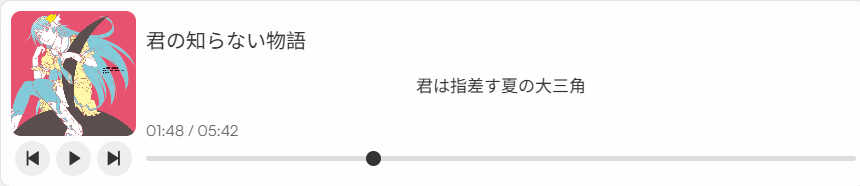
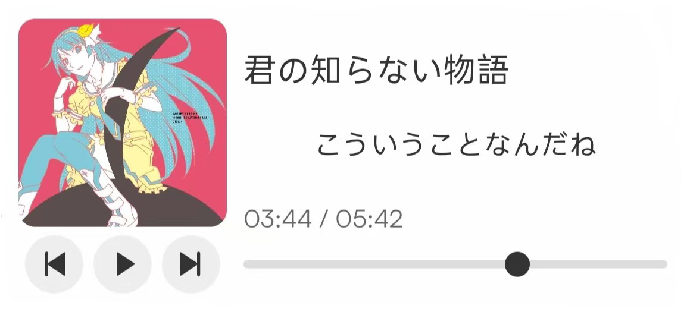

# 用于 Astro 项目的音乐播放器

受到 [Music-Player-to-Astro-Sidebar](https://github.com/D-K-Deng/Music-Player-to-Astro-Sidebar) 的启发，在其基础上，实现了一个可用于用于Astro博客的音乐播放器。该播放器支持播放本地音乐文件，并且可以显示当前播放的歌词。

该音乐播放器可作为Astro博客的一个组件，用于在 `.mdx` 博文中添加音乐播放功能。当然，你也可以把他用于其他 `.astro` 文件。

## 效果展示

**PC端**  


**移动端**  


## 使用方法

### 在 `.mdx` 文件中使用

将 `MusicPlayer.svelte` 组件添加到Astro博客的 `src/components/` 目录或其子目录下 (例如 `src/components/widget/`) 。

在后缀为 `.mdx` 的文件中，使用以下代码引入音乐播放器组件：

```mdx
{/* 注意 MusicPlayer.svelte 所在目录 */}
import MusicPlayer from '@/components/widget/MusicPlayer.svelte'
```

在需要使用音乐播放器的位置，使用以下代码引入组件：

```mdx
{/* 下面的路径均为相对于 `/public/` 的路径 */}
<MusicPlayer client:load audioList={[
    {
        name: '君の知らない物語',                               {/* 播放器显示音乐名称 */}
        src: '/music/君の知らない物語/君の知らない物語.flac',   {/* 音乐文件路径 */}
        cover: '/music/君の知らない物語/君の知らない物語.png',  {/* 音乐封面路径 */}
        lrc: '/music/君の知らない物語/君の知らない物語.lrc'     {/* 音乐歌词路径 */}
    }
]}/>
```
